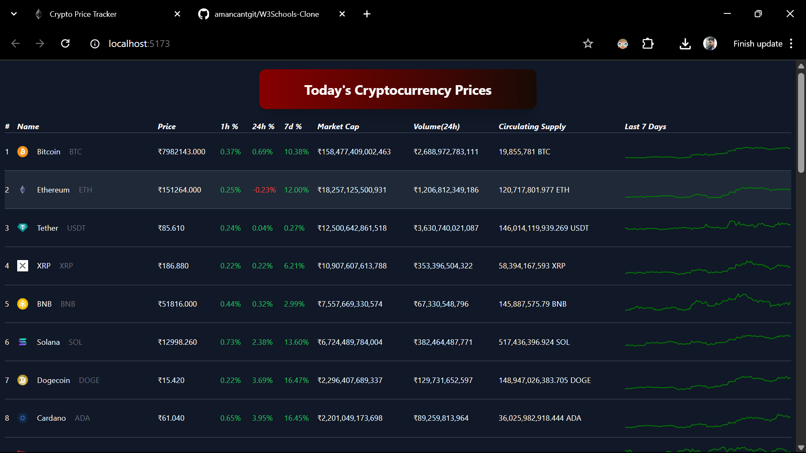

# Crypto Price Tracker

## Project Description:
This project is a real-time cryptocurrency price tracker, it fetches live price data from the CoinGecko API, displays prices in INR, and shows mini graphs (sparklines) for price trends. The prices update every 2 seconds, offering an interface similar to CoinMarketCap.

[Crypto Price Tracker](https://amancantgit.github.io/Crypto-Price-Tracker/)



### `Features`:
1. Real-time price updates every 2 seconds.
2. Mini graphs (sparklines) for price trends over 7 days.
3. Price rates displayed in INR.

### `Technologies used`: 
- React.js: For building the user interface.
- Axios: For fetching data from the CoinGecko API.
- WebSocket: To receive real-time price updates.
- Tailwind CSS: For styling the components and layout.

### Installation Steps:
Follow these steps to set up and run the project locally:

1. **Clone the repository:**
   Clone the repository to your local machine by running the following command in your terminal:
   ```sh
   git clone https://github.com/your-username/crypto-price-tracker.git
2. Install any neccessary dependencies.
3. Run the project locally using npm start.
